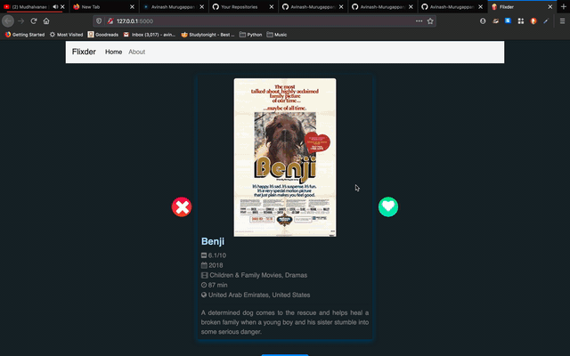

# Flixder - 'Tinder' for Netflix 🎥 + 🍿

A python flask app that generates random netflix movie and show recommendations, with it's details listed for each title, that a user can swipe through and watch with the click of a button.



## Inspiration
Always wanted to work with a python web framework and so here I am implementing something basic with flask and python to get started. 

## Installation
1. Install Flask

    ```$ pip install flask```
2. (Option) Install virtualenv to manage dependencies (only needed for Python 2 uesrs):

    ```$ pip install virtualenv # only needed for Python 2```

3. Obtain an API Key for OMDB, and add to a `config.py` file using the following format:

    ```
    api_key = "YOUR_KEY"
    ```
    If you are ever adding your own code to GitHub, make sure this `config.py` file is listed under a `.gitignore` file so it doesn't accidently get published to GitHub!

4. Download the CSV linked in [this Kaggle dataset](https://www.kaggle.com/shivamb/netflix-shows) and name the file `catalog.csv`. This will store the bulk of our data.


## Usage
#### To launch the app:
    $ python main.py

Once the Flask app is running, navigate to the `localhost` link provided:

<code> * Running on <b>http://127.0.0.1:5000/</b> (Press CTRL+C to quit)</code>


## Thanks

* [Open Movie Database](http://www.omdbapi.com/) - Movie data API to fetch movie poster links and IMDB scores
* [Kaggle Netflix Dataset](https://www.kaggle.com/shivamb/netflix-shows) - Comprehensive dataset with many Netflix movies/tv shows and their metadata
* [Flask Starter Code](https://github.com/salvillalon45/SPGISummer2018-FlaskTutorial) - A place to get started with Flask code

## Learn More

* [Flask Starter Guide](https://www.freecodecamp.org/news/how-to-build-a-web-application-using-flask-and-deploy-it-to-the-cloud-3551c985e492/) - A great starter guide on how to learn Flask
* [Flask Tutorial](https://blog.miguelgrinberg.com/post/the-flask-mega-tutorial-part-i-hello-world) - A more in-depth tutorial on Flask
* [About .gitignore and config giles](https://medium.com/black-tech-diva/hide-your-api-keys-7635e181a06c) - A step-by-step guide on how to hide your API keys

## License

This project is licensed under the MIT License.
